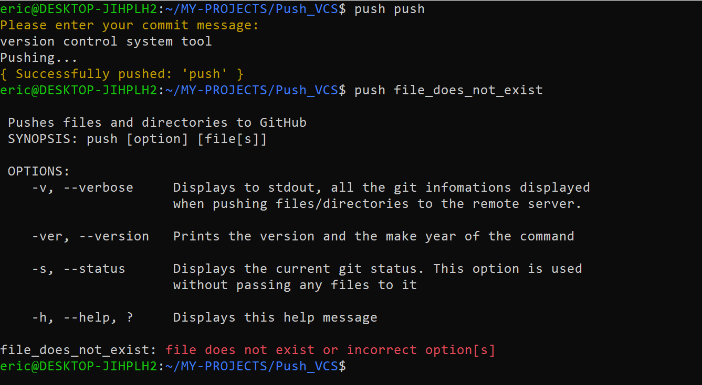

# Push Version Control System Tool

**Push** is a **version control system tool** that manages sources code as to how git works.




## The goals of the command:
* To limits the time it takes to type
```
$ git add file
$ git commit -m <COMMIT_MSG>
$ git push
```
when trying to upload projects and source codes to GitHub.
* Make use of options that enhances the use of the command; such as:
	- -v, --verbose:	By default push doesn't display information, but it does when this opition is specified.
	- -s, --status		Prints the git status of project
	- -h, --help, ?:	Displays help informations on how to use it.
	- -ver, --version:	Displays the version and make year of this command.
	- and others...
* **Note:** It is not meant to replace the `git` VCS, but to enhance it.

## Installation
To use this command, follow the following steps
1. Clone this repo:
```
$ git clone https://github.com/Vulcanric/Push_VCS.git
```
2. Change Directory to the **Push_VCS** repo.
```
$ cd Push_VCS
```
3. When inside the directory, make the file `installer` executable.
```
$ chmod +x installer
```
4. Run the installer to use the command.
```
$ ./installer
```
5. Run again, to confirm.

6. Now you can use the `push` command.

## How to use
To use, start by using the help options
`push -h` OR `push --help` OR `push ?`
